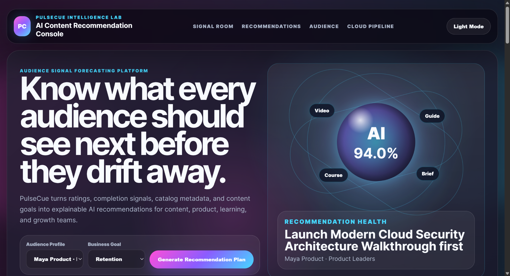
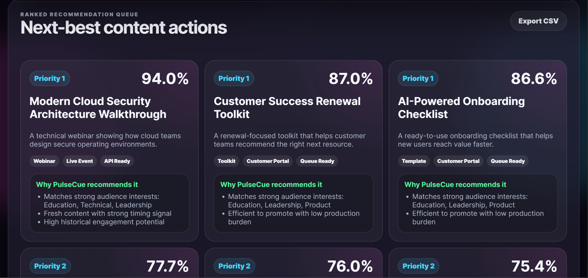
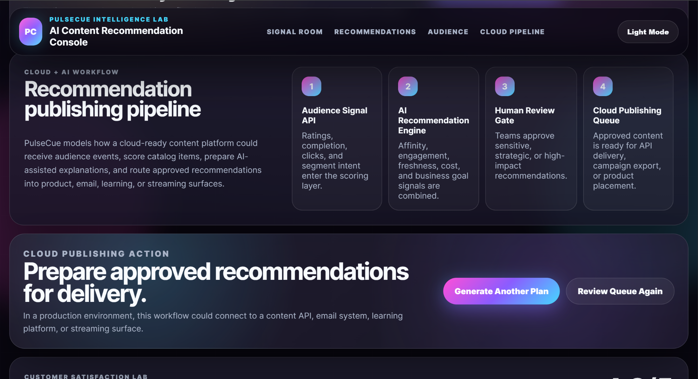

# PulseCue AI Content Recommendation And Engagement Console

## Overview

PulseCue is an enterprise-style AI content recommendation and audience engagement console. It upgrades the original lightweight Python recommendation prototype into a product-ready internal platform concept for content, media, education, SaaS, and growth teams.

The dashboard helps teams decide which content should be recommended next, why it matches an audience, what engagement lift it may create, and how recommendations could move into a cloud publishing workflow.

## Real-World Business Use Case

Content teams often have too much content and not enough clarity. PulseCue helps answer:

- What should each audience segment see next?
- Which recommendation has the strongest fit?
- Why did the system recommend this content?
- Which content supports retention, activation, growth, or trust?
- What should move into the cloud publishing queue?

This type of system maps to workflows used by streaming platforms, online learning libraries, customer education teams, internal enablement teams, and SaaS content operations teams.

## Key Features

- AI-style recommendation dashboard
- Audience profile selector
- Business goal selector for retention, activation, growth, and trust
- Ranked next-best content recommendations
- Explainable “why this was recommended” logic
- Audience taste map
- Engagement lift forecast
- Recommendation strategy brief
- Content cluster health
- Recent audience history
- Cloud + AI publishing pipeline
- CSV export endpoint
- Synthetic customer review section for product storytelling
- Light and dark mode

## Tech Stack

- Python
- Flask
- Pandas
- NumPy
- HTML
- CSS
- JavaScript

## Cloud + AI Direction

PulseCue models how a cloud-ready recommendation workflow could operate:

1. Audience signals enter through an API layer.
2. Recommendation logic scores the content catalog.
3. AI-generated explanations help humans understand the recommendation.
4. Approved recommendations move into a cloud publishing queue.
5. Product, email, learning, and streaming surfaces receive the next-best content.

## Safe Demo Boundary

This project uses synthetic sample data only. It does not collect real user behavior, connect to external customer systems, or claim production-level AI personalization. It is a portfolio-ready simulation of recommendation intelligence workflows.

## How To Run

### 1. Create And Activate A Virtual Environment

```powershell
python -m venv .venv
.\.venv\Scripts\Activate.ps1

## Screenshot Gallery

### Dashboard Overview


### Recommendation Queue


### Cloud Pipeline CTA


## Final Project Name

PulseCue AI Content Recommendation And Engagement Console
